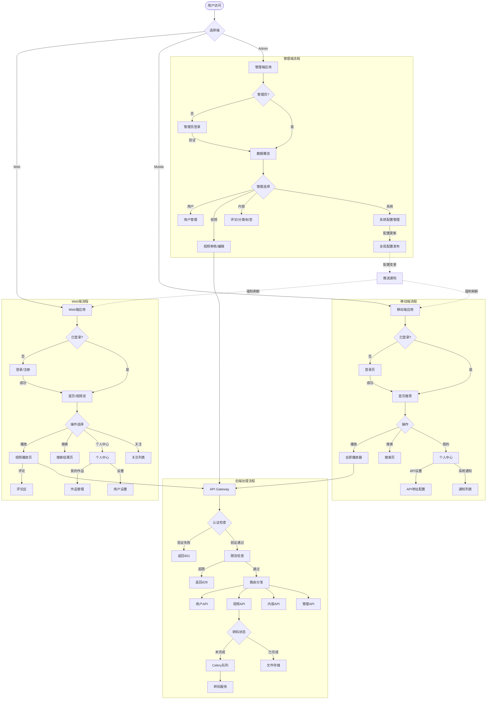
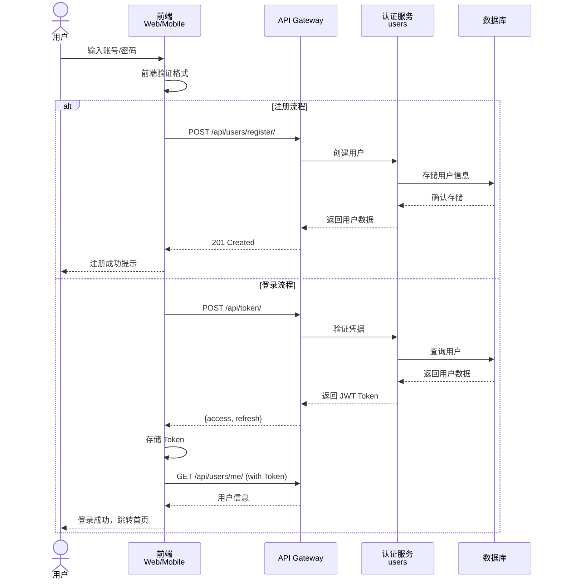
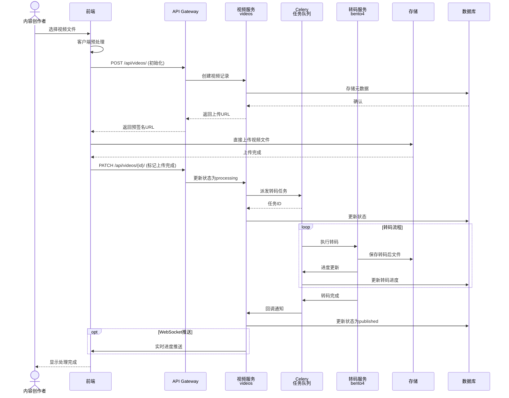
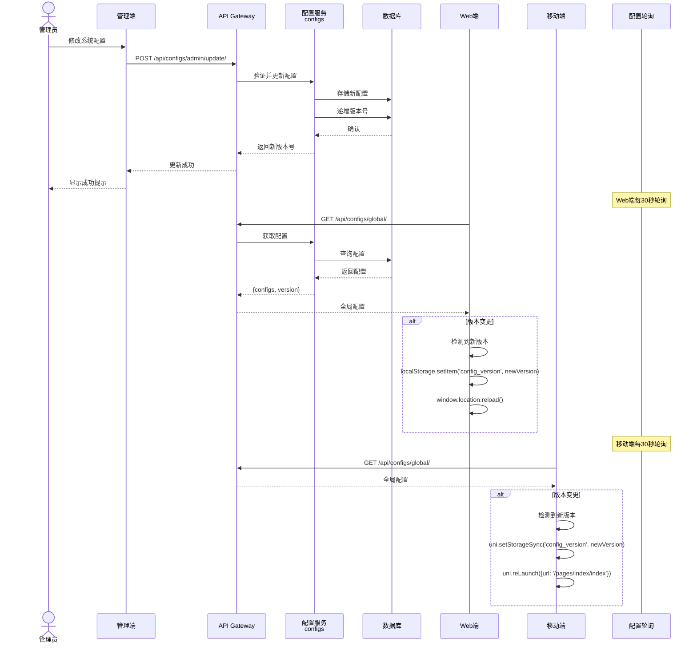
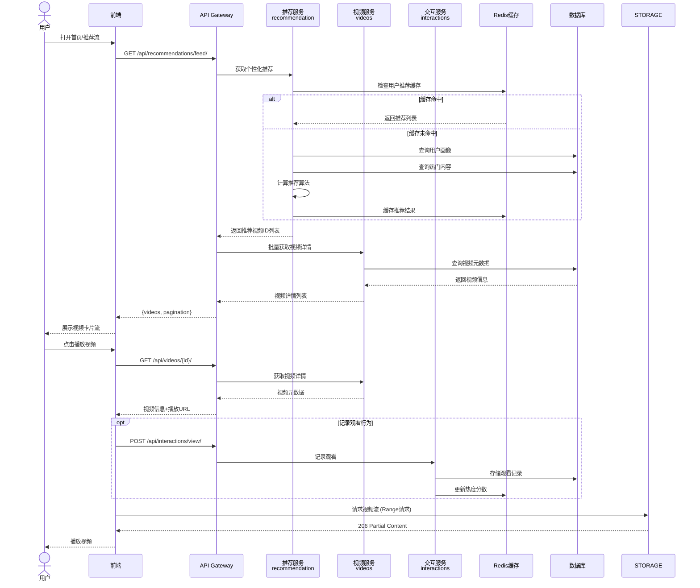
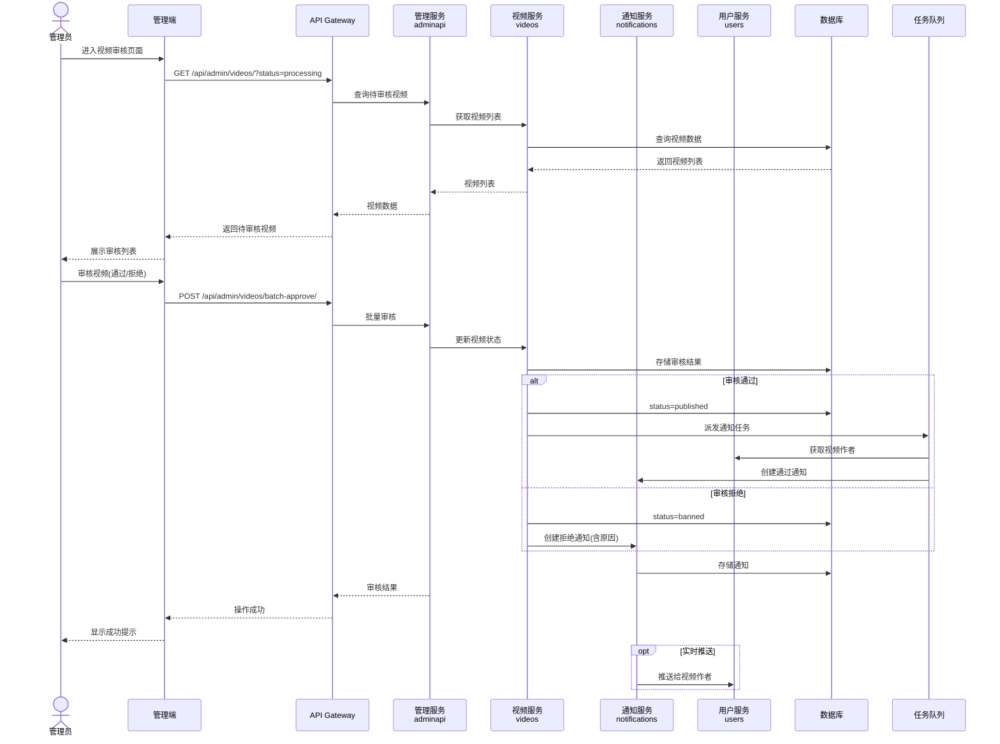

# BS01 项目功能架构图

## 一、功能模块图

```mermaid
graph TB
    subgraph 后端["后端 (Django)"]
        subgraph Core["核心模块"]
            CORE[core]
            TASKS[tasks<br/>任务队列]
        end
        
        subgraph UserModule["用户模块"]
            USERS[users<br/>用户管理]
            AUTH[认证/权限]
            PROFILE[个人资料]
        end
        
        subgraph ContentModule["内容模块"]
            VIDEOS[videos<br/>视频管理]
            CONTENT[content<br/>评论/内容]
            INTER[interactions<br/>点赞/收藏/关注]
        end
        
        subgraph AdminModule["管理模块"]
            ADMIN[adminapi<br/>管理API]
            CONFIG[configs<br/>全局配置]
            ANALYTICS[analytics<br/>统计分析]
            AUDIT[审计日志]
        end
        
        subgraph ServiceModule["服务模块"]
            NOTIF[notifications<br/>通知系统]
            REC[recommendation<br/>推荐系统]
        end
    end
    
    subgraph Web端["Web端 (Vue3)"]
        W_AUTH[认证模块<br/>登录/注册]
        W_HOME[首页/视频流]
        W_VIDEO[视频播放/详情]
        W_ME[个人中心<br/>作品/喜欢/收藏]
        W_SOCIAL[社交功能<br/>关注/好友]
        W_SEARCH[搜索发现]
    end
    
    subgraph AdminConsole["管理端 (Vue3)"]
        A_LOGIN[登录]
        A_ANALYTICS[数据概览]
        A_USERS[用户管理]
        A_VIDEOS[视频审核/管理]
        A_CONTENT[评论/分类/标签]
        A_SYSTEM[系统配置]
        A_ANNOUNCE[公告管理]
    end
    
    subgraph Mobile端["移动端 (UniApp)"]
        M_AUTH[认证]
        M_HOME[首页/推荐]
        M_PLAYER[视频播放器]
        M_USER[个人中心]
        M_SETTINGS[设置/API配置]
    end
    
    subgraph 数据库["数据库"]
        DB[(PostgreSQL)]
        CACHE[(Redis)]
    end
    
    %% 后端连接
    CORE --> DB
    USERS --> DB
    VIDEOS --> DB
    CONTENT --> DB
    INTER --> DB
    ADMIN --> DB
    CONFIG --> DB
    ANALYTICS --> DB
    NOTIF --> CACHE
    REC --> CACHE
    
    %% 前端连接后端
    W_AUTH --> AUTH
    W_HOME --> REC
    W_VIDEO --> VIDEOS
    W_VIDEO --> CONTENT
    W_ME --> USERS
    W_SOCIAL --> INTER
    W_SEARCH --> VIDEOS
    
    A_LOGIN --> ADMIN
    A_USERS --> USERS
    A_VIDEOS --> VIDEOS
    A_CONTENT --> CONTENT
    A_SYSTEM --> CONFIG
    A_ANNOUNCE --> NOTIF
    
    M_AUTH --> AUTH
    M_HOME --> REC
    M_PLAYER --> VIDEOS
    M_USER --> USERS
    M_SETTINGS --> CONFIG
```

## 二、总功能流程图

## 三、时序图

### 3.0 整体项目架构时序图（宏观视角）

```mermaid
sequenceDiagram
    actor User as 用户/管理员
    participant Web as Web端<br/>(Vue3+Pinia)
    participant Mobile as 移动端<br/>(UniApp)
    participant Admin as 管理端<br/>(Vue3)
    participant Nginx as Nginx/CDN
    participant APIGW as API Gateway<br/>(Django)
    
    box 后端核心服务
    participant Auth as 认证服务<br/>users
    participant VideoS as 视频服务<br/>videos
    participant ContentS as 内容服务<br/>content
    participant Interact as 交互服务<br/>interactions
    participant Rec as 推荐服务<br/>recommendation
    participant Config as 配置服务<br/>configs
    participant AdminS as 管理服务<br/>adminapi
    end
    
    box 基础设施
    participant Celery as 任务队列<br/>Celery+Redis
    participant Trans as 转码服务<br/>bento4
    participant Notify as 通知服务<br/>notifications
    participant DB as PostgreSQL
    participant Cache as Redis缓存
    participant Storage as 对象存储
    end

    %% ========== 系统初始化阶段 ==========
    Note over Web,Storage: ════════════ 系统初始化/配置同步 ════════════
    
    par 各端启动初始化
        Web->>APIGW: 1a. GET /api/configs/global/
        Mobile->>APIGW: 1b. GET /api/configs/global/
        Admin->>APIGW: 1c. GET /api/configs/global/
    end
    
    APIGW->>Config: 查询全局配置
    Config->>DB: SELECT config entries
    DB-->>Config: 返回配置数据
    Config-->>APIGW: {configs, version}
    
    par 配置下发
        APIGW-->>Web: 全局配置+版本号
        APIGW-->>Mobile: 全局配置+版本号
        APIGW-->>Admin: 全局配置+版本号
    end
    
    Note right of Web: 每30秒轮询检测版本变更
    
    %% ========== 用户认证流程 ==========
    Note over User,Storage: ════════════ 用户认证流程 ════════════
    
    User->>Web: 2. 输入账号密码
    Web->>APIGW: POST /api/token/
    APIGW->>Auth: 验证凭据
    Auth->>DB: 查询用户数据
    DB-->>Auth: 用户记录
    Auth-->>APIGW: JWT Token (access+refresh)
    APIGW-->>Web: {access, refresh, user}
    Web->>Web: 存储Token到localStorage
    Web-->>User: 登录成功
    
    %% ========== 首页/推荐加载 ==========
    Note over User,Storage: ════════════ 首页推荐加载 ════════════
    
    User->>Mobile: 3. 打开首页
    Mobile->>APIGW: GET /api/recommendations/feed/
    APIGW->>Rec: 获取推荐列表
    
    alt 缓存命中
        Rec->>Cache: GET user:{id}:recommendations
        Cache-->>Rec: 返回缓存列表
    else 缓存未命中
        Rec->>DB: 查询用户画像+热门内容
        Rec->>Rec: 执行推荐算法
        Rec->>Cache: SETEX 缓存结果
    end
    
    Rec-->>APIGW: 推荐视频ID列表
    APIGW->>VideoS: 批量获取视频详情
    VideoS->>DB: SELECT videos
    DB-->>VideoS: 视频元数据
    VideoS-->>APIGW: 视频详情列表
    APIGW-->>Mobile: {videos, has_more}
    Mobile-->>User: 展示视频Feed
    
    %% ========== 视频播放流程 ==========
    Note over User,Storage: ════════════ 视频播放流程 ════════════
    
    User->>Web: 4. 点击播放视频
    Web->>APIGW: GET /api/videos/{id}/
    APIGW->>VideoS: 获取视频详情
    VideoS->>DB: 查询视频数据
    DB-->>VideoS: 视频记录
    VideoS-->>APIGW: 视频信息+播放URL
    APIGW-->>Web: 视频详情
    
    par 并行处理
        Web->>Storage: 请求视频流 (Range: bytes=0-)
        Storage-->>Web: 206 Partial Content
        
        Web->>APIGW: POST /api/interactions/view/ (异步)
        APIGW->>Interact: 记录观看行为
        Interact->>DB: INSERT view record
        Interact->>Cache: INCR video:view_count
    end
    
    Web-->>User: 开始播放视频
    
    %% ========== 社交互动流程 ==========
    Note over User,Storage: ════════════ 社交互动流程 ════════════
    
    User->>Mobile: 5. 点赞/收藏/关注
    Mobile->>APIGW: POST /api/interactions/like/
    APIGW->>Interact: 处理互动请求
    Interact->>DB: 创建/更新互动记录
    Interact->>Cache: 更新计数器
    Interact->>Notify: 创建通知任务
    Notify->>Celery: 派发异步通知
    Celery-->>Notify: 任务ID
    Notify-->>Interact: 确认
    Interact-->>APIGW: 操作结果
    APIGW-->>Mobile: 成功响应
    Mobile-->>User: 互动成功反馈
    
    %% ========== 视频上传/转码流程 ==========
    Note over User,Storage: ════════════ 视频上传/处理流程 ════════════
    
    User->>Web: 6. 选择视频上传
    Web->>APIGW: POST /api/videos/ (初始化)
    APIGW->>VideoS: 创建视频记录
    VideoS->>DB: INSERT video (status=draft)
    DB-->>VideoS: 视频ID
    VideoS-->>APIGW: 视频记录+上传URL
    APIGW-->>Web: 返回上传凭证
    
    Web->>Storage: PUT 视频文件 (直传)
    Storage-->>Web: 上传完成
    
    Web->>APIGW: PATCH /api/videos/{id}/ (标记完成)
    APIGW->>VideoS: 更新状态processing
    VideoS->>DB: UPDATE status
    VideoS->>Celery: 派发转码任务
    Celery->>Celery: 任务队列
    
    loop 异步转码流程
        Celery->>Trans: 执行转码 (HLS/多码率)
        Trans->>Storage: 保存转码后文件
        Trans->>Celery: 进度回调
        Celery->>VideoS: 更新进度
        VideoS->>DB: UPDATE progress
    end
    
    Trans-->>Celery: 转码完成
    Celery->>VideoS: 任务完成回调
    VideoS->>DB: UPDATE status=published
    VideoS->>Notify: 通知作者
    
    %% ========== 评论系统流程 ==========
    Note over User,Storage: ════════════ 评论系统流程 ════════════
    
    User->>Mobile: 7. 发表评论
    Mobile->>APIGW: POST /api/comments/
    APIGW->>ContentS: 创建评论
    ContentS->>DB: INSERT comment
    ContentS->>Cache: 更新评论计数
    ContentS->>Notify: 通知视频作者
    ContentS-->>APIGW: 评论数据
    APIGW-->>Mobile: 发布成功
    
    %% ========== 管理后台操作 ==========
    Note over User,Storage: ════════════ 管理后台操作流程 ════════════
    
    User->>Admin: 8. 管理员登录
    Admin->>APIGW: POST /api/token/ + isAdmin check
    APIGW->>Auth: 验证+权限检查
    Auth-->>APIGW: Token+adminInfo
    APIGW-->>Admin: 登录成功
    
    Admin->>APIGW: GET /api/admin/analytics/overview/
    APIGW->>AdminS: 获取统计数据
    AdminS->>DB: 聚合查询 (users/videos/views)
    AdminS->>Cache: 缓存统计结果
    AdminS-->>APIGW: 数据概览
    APIGW-->>Admin: 展示仪表盘
    
    %% ========== 视频审核流程 ==========
    Note over User,Storage: ════════════ 视频审核流程 ════════════
    
    User->>Admin: 9. 进入视频审核
    Admin->>APIGW: GET /api/admin/videos/?status=processing
    APIGW->>AdminS: 查询待审核视频
    AdminS->>VideoS: 获取视频列表
    VideoS->>DB: SELECT with filter
    DB-->>VideoS: 视频列表
    VideoS-->>AdminS: 视频数据
    AdminS-->>APIGW: 分页结果
    APIGW-->>Admin: 展示审核列表
    
    User->>Admin: 执行审核(通过/拒绝)
    Admin->>APIGW: POST /api/admin/videos/batch-approve/
    APIGW->>AdminS: 批量更新状态
    AdminS->>VideoS: 更新视频状态
    VideoS->>DB: UPDATE status
    VideoS->>Notify: 发送审核结果通知
    Notify->>Celery: 异步通知任务
    VideoS-->>AdminS: 更新结果
    AdminS-->>APIGW: 批量操作结果
    APIGW-->>Admin: 操作成功
    
    %% ========== 系统配置更新同步 ==========
    Note over User,Storage: ════════════ 系统配置同步流程 ════════════
    
    User->>Admin: 10. 修改系统配置
    Admin->>APIGW: POST /api/configs/admin/update/
    APIGW->>Config: 更新配置
    Config->>DB: UPDATE configs + version++
    DB-->>Config: 确认
    Config-->>APIGW: 新版本号
    APIGW-->>Admin: 更新成功
    
    par 各端检测版本变更
        Web->>APIGW: 轮询 GET /api/configs/global/
        Mobile->>APIGW: 轮询 GET /api/configs/global/
    end
    
    APIGW-->>Web: {config, newVersion}
    APIGW-->>Mobile: {config, newVersion}
    
    alt 检测到版本变更
        Web->>Web: 对比localStorage版本
        Web->>Web: window.location.reload()
        Mobile->>Mobile: 对比storage版本
        Mobile->>Mobile: uni.reLaunch()
    end
    
    %% ========== 搜索流程 ==========
    Note over User,Storage: ════════════ 搜索流程 ════════════
    
    User->>Web: 11. 输入搜索词
    Web->>APIGW: GET /api/search/?q=keyword
    APIGW->>VideoS: 搜索视频
    VideoS->>Cache: 检查搜索结果缓存
    alt 缓存未命中
        VideoS->>DB: 全文搜索 (title/desc/tags)
        VideoS->>Cache: 缓存结果 (1min)
    end
    VideoS-->>APIGW: 搜索结果
    APIGW-->>Web: {results, facets}
    Web-->>User: 展示搜索结果
```

### 3.1 用户登录/注册时序

### 3.2 视频上传/处理时序

### 3.3 系统配置同步时序

### 3.4 视频播放/推荐时序

### 3.5 管理审核流程时序

## 模块说明

### 后端模块
| 模块 | 功能描述 |
|------|---------|
| users | 用户注册、登录、认证、个人资料管理 |
| videos | 视频上传、转码、存储、播放、元数据管理 |
| content | 评论系统、内容审核 |
| interactions | 点赞、收藏、关注、分享等社交互动 |
| adminapi | 管理员专用的用户/视频/内容管理API |
| configs | 全局配置管理、版本控制、客户端同步 |
| analytics | 数据统计、趋势分析、报表生成 |
| notifications | 系统公告、用户通知、推送服务 |
| recommendation | 个性化推荐算法、热门内容计算 |
| tasks | Celery任务队列、异步处理调度 |
| core | 核心工具、中间件、通用功能 |

### 前端模块
| 端 | 主要功能 |
|----|---------|
| Web端 | 视频浏览、搜索、播放、社交互动、个人中心 |
| 管理端 | 数据统计、用户管理、视频审核、系统配置 |
| 移动端 | 推荐流、视频播放、个人中心、API设置 |

## 关键技术特性

1. **配置同步机制**: 管理端修改配置后，Web端和移动端通过轮询检测版本变更，自动刷新同步
2. **视频转码**: 异步Celery任务队列处理视频转码，支持断点续传
3. **推荐系统**: 基于Redis缓存的个性化推荐算法
4. **权限控制**: JWT认证 + 管理员权限检查
5. **API地址配置**: 各端支持动态配置API基址，便于测试和部署
