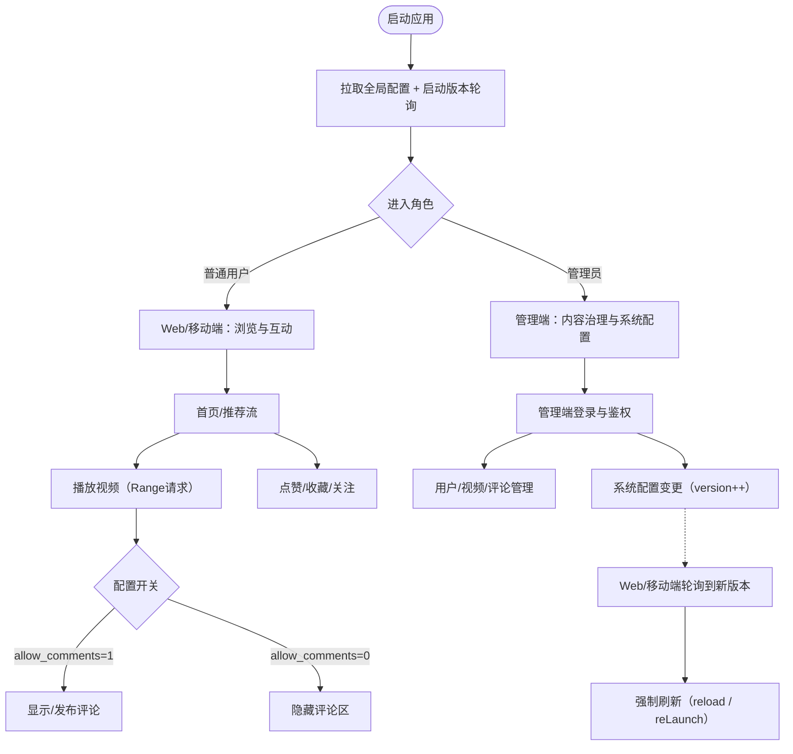
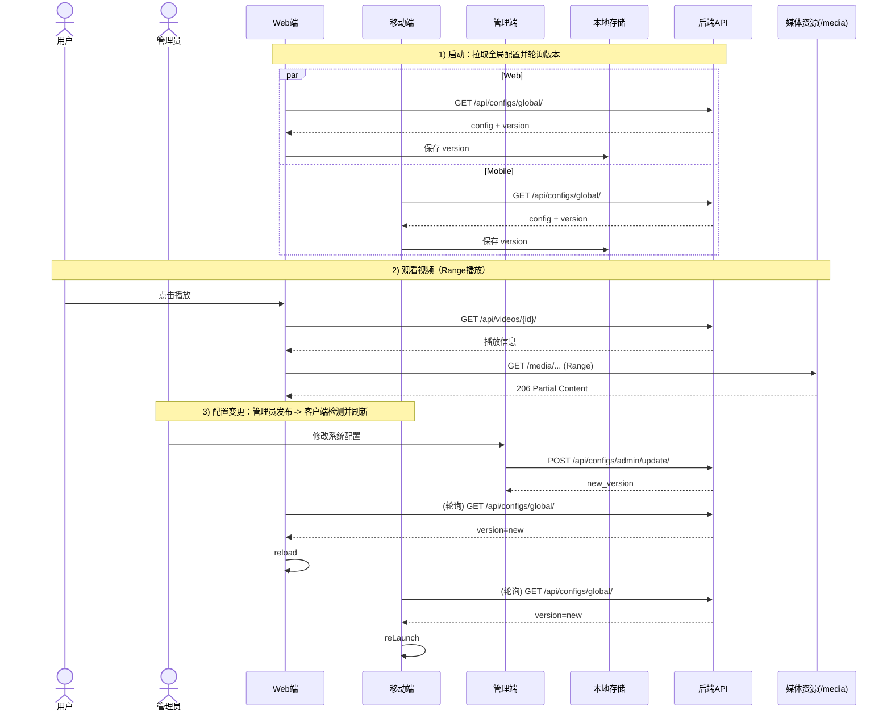

# BS01 前端架构图（仅前端：Web / 管理端 / 移动端）

> 说明：本文只描述前端工程的模块划分、页面/路由流转、以及前端与后端 API 的交互时序；不展开后端内部服务拆分。

## 一、前端功能模块图（按业务功能划分）


```mermaid
graph TB
  subgraph C["客户端类型"]
    direction TB
    Web["Web端\nVue3 + Pinia"]
    Admin["管理端\nVue3"]
    Mobile["移动端\nUniApp + Pinia"]
  end

  subgraph M1["认证与用户模块"]
    Login["登录/注册\n(allow_register控制)"]
    Profile["个人中心\n编辑资料/头像"]
    Follow["关注/粉丝列表"]
    Notify["消息通知"]
  end

  subgraph M2["视频内容模块"]
    Home["首页/推荐流"]
    Player["视频播放器\n(支持HTTP Range)"]
    Upload["视频上传\n直传+转码回调"]
    Edit["视频编辑\n标题/描述/分类/标签"]
  end

  subgraph M3["互动模块"]
    Comment["评论系统\n(allow_comments控制)"]
    Like["点赞"]
    Fav["收藏/稍后再看"]
    Share["分享"]
  end

  subgraph M4["发现模块"]
    Search["搜索视频/用户"]
    Featured["精选/热门"]
    Category["分类浏览"]
  end

  subgraph M5["系统配置模块"]
    ApiCfg["API地址设置\n(show_api_base控制)"]
    Theme["主题切换\n(深色/浅色)"]
    GlobalCfg["全局配置同步\n30s轮询+版本检测"]
  end

  subgraph M6["管理功能模块（仅管理端）"]
    UserMgmt["用户管理\n启用/禁用/设为管理员"]
    VideoAudit["视频审核\n通过/拒绝/转码重试"]
    CmtMgmt["评论管理\n删除违规评论"]
    SysCfg["系统配置\n全局开关/版本发布"]
    Stats["数据统计\n用户/视频/观看量"]
  end

  %% Web端功能映射
  Web --> Login
  Web --> Profile
  Web --> Follow
  Web --> Home
  Web --> Player
  Web --> Upload
  Web --> Edit
  Web --> Comment
  Web --> Like
  Web --> Fav
  Web --> Search
  Web --> Featured
  Web --> ApiCfg
  Web --> Theme
  Web --> GlobalCfg

  %% 移动端功能映射
  Mobile --> Login
  Mobile --> Profile
  Mobile --> Follow
  Mobile --> Notify
  Mobile --> Home
  Mobile --> Player
  Mobile --> Upload
  Mobile --> Comment
  Mobile --> Like
  Mobile --> Fav
  Mobile --> Search
  Mobile --> Category
  Mobile --> ApiCfg
  Mobile --> Theme
  Mobile --> GlobalCfg

  %% 管理端功能映射
  Admin --> Login
  Admin --> UserMgmt
  Admin --> VideoAudit
  Admin --> CmtMgmt
  Admin --> SysCfg
  Admin --> Stats
  Admin --> GlobalCfg

  %% 配置控制关系
  SysCfg -.->|发布配置| GlobalCfg
  GlobalCfg -.->|控制显示| ApiCfg
  GlobalCfg -.->|控制功能| Login
  GlobalCfg -.->|控制功能| Comment
```
```

## 二、前端功能流程图（跨端用户视角）


```mermaid
flowchart TD
  S([启动应用]) --> I[拉取全局配置 + 启动版本轮询]
  I --> R{进入角色}

  R -->|普通用户| U[Web/移动端：浏览与互动]
  R -->|管理员| A[管理端：内容治理与系统配置]

  U --> B[首页/推荐流]
  B --> P[播放视频（Range请求）]
  P --> X{配置开关}
  X -->|allow_comments=1| C[显示/发布评论]
  X -->|allow_comments=0| C0[隐藏评论区]
  B --> O[点赞/收藏/关注]

  A --> D[管理端登录与鉴权]
  D --> M[用户/视频/评论管理]
  D --> G[系统配置变更（version++）]

  G -.-> V[Web/移动端轮询到新版本]
  V --> F[强制刷新（reload / reLaunch）]
```

## 三、整体项目架构时序图（前端视角）


```mermaid
sequenceDiagram
  actor U as 用户
  actor A as 管理员
  participant Web as Web端
  participant Mobile as 移动端
  participant Admin as 管理端
  participant Store as 本地存储
  participant API as 后端API
  participant Media as 媒体资源(/media)

  Note over Web,API: 1) 启动：拉取全局配置并轮询版本
  par Web
    Web->>API: GET /api/configs/global/
    API-->>Web: config + version
    Web->>Store: 保存 version
  and Mobile
    Mobile->>API: GET /api/configs/global/
    API-->>Mobile: config + version
    Mobile->>Store: 保存 version
  end

  Note over U,Media: 2) 观看视频（Range播放）
  U->>Web: 点击播放
  Web->>API: GET /api/videos/{id}/
  API-->>Web: 播放信息
  Web->>Media: GET /media/... (Range)
  Media-->>Web: 206 Partial Content

  Note over A,Mobile: 3) 配置变更：管理员发布 -> 客户端检测并刷新
  A->>Admin: 修改系统配置
  Admin->>API: POST /api/configs/admin/update/
  API-->>Admin: new_version
  Web->>API: (轮询) GET /api/configs/global/
  API-->>Web: version=new
  Web->>Web: reload
  Mobile->>API: (轮询) GET /api/configs/global/
  API-->>Mobile: version=new
  Mobile->>Mobile: reLaunch
```
